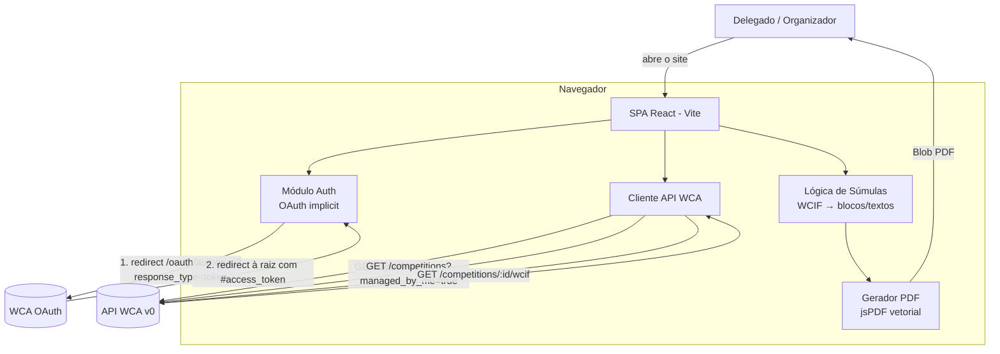
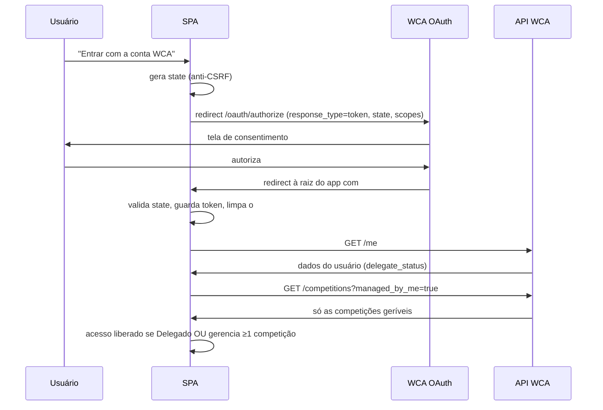
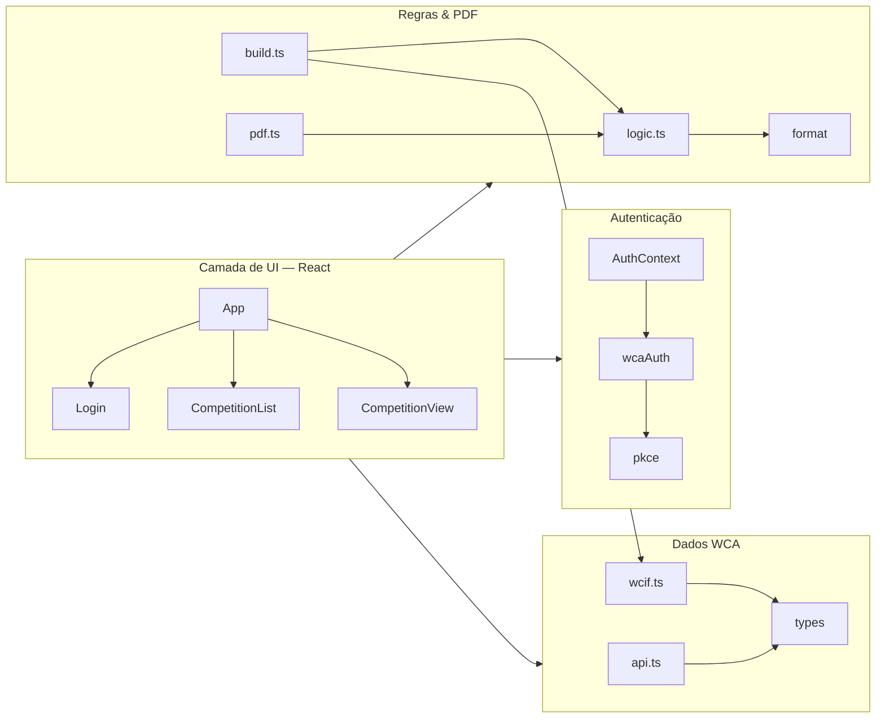

# Arquitetura — Súmulas WCA

Aplicação **100% client-side** (SPA React). Não há back-end próprio: o
navegador fala diretamente com a API oficial da WCA usando **OAuth 2.0
(implicit grant)** — cliente público, sem `client_secret`, o mesmo fluxo do
Groupifier/AGE. Isso zera o custo de servidor e casa com a diretriz do projeto
CubingSP (`delegate-tools` roda no navegador).

## Visão geral (fluxo de dados)

## Fluxo de autenticação e permissão

**Restrição de acesso (dupla):**

1. **Nível de conta** — a UI só é liberada se o usuário for Delegado
   (`delegate_status` da API) **ou** aparecer como gestor de ao menos uma
   competição.
2. **Nível de competição** — a lista vem de
   `GET /competitions?managed_by_me=true`, que é a própria API da WCA
   filtrando pelas competições em que o usuário é **Delegado ou
   Organizador**. Assim, a geração de súmulas fica limitada a essas
   competições — não há como gerar para uma competição de terceiros.

## Módulos (camadas)

| Camada | Arquivos | Responsabilidade |
|---|---|---|
| Autenticação | `src/auth/*` | OAuth implicit grant, guarda de token, contexto React |
| Dados WCA | `src/wca/api.ts`, `src/wca/types.ts`, `src/wca/wcif.ts` | Chamadas à API, tipos WCIF, extração de rodadas/grupos/competidores |
| Regras & PDF | `src/scorecards/*` | Lógica dinâmica (cutoff, cumulativo, blocos), `template.ts` (HTML/CSS da súmula), `paper.ts` (folhas), `export.ts` (html2canvas → jsPDF) |
| UI | `src/components/*`, `src/App.tsx` | Telas responsivas em pt-BR |

## Regras dinâmicas da súmula (resumo do que `logic.ts` decide)

| Situação (WCIF) | DNF (antes do 1º bloco) | Divisão dos blocos | Texto intermediário |
|---|---|---|---|
| Qualquer formato **com cutoff** | `DNF se > {limite}` | 1..k / k+1..N | `Tempo de corte se > {corte}` |
| **Sem cutoff** (inclui Ao5, Mo3, Bo3…) | `DNF se > {limite}` | bloco único (todos os solves) | — (sem linha de corte) |
| Limite **cumulativo** (3BLD, Multi) | `Tempo cumulativo de {limite}` | conforme cutoff | conforme cutoff |
| FMC / Multi (pontuação) | — (sem penalidade de tempo) | conforme formato | — |

O nº de solves (N) vem do **formato da rodada** (`a`=5, `m`/`3`=3, `2`=2,
`1`=1), então mudanças de regra como o **3x3x3 Blindfolded → Bo5/Ao5 (2026)**
são refletidas automaticamente pelos dados oficiais, sem alterar o código.

Extras **E1/E2** têm sempre uma coluna adicional **D** (assinatura do
Delegado), pois tentativas extras exigem aval do Delegado.

## Decisões de arquitetura

- **Implicit grant (como Groupifier/AGE)**: é o fluxo que a WCA aceita para
  cliente público sem secret — o token volta no fragmento `#` da URL raiz.
  Validamos `state` (anti-CSRF) e guardamos o token no `localStorage` (~2h).
  Elimina back-end e gestão de secrets. (Fluxo com code+PKCE exigiria endpoint
  de token compatível, que a WCA não garante para cliente público.)
- **Súmula em HTML/CSS rasterizada (html2canvas) e composta no PDF (jsPDF)**:
  permite tipografia bonita (Inter), cantos arredondados, e — crucialmente —
  **renderizar nomes com caracteres CJK** usando as fontes do navegador, o que
  seria inviável com texto vetorial sem embarcar fontes CJK pesadas. Cada
  súmula é desenhada num tamanho de projeto constante (A6) e **escalada** para
  o retângulo alvo, garantindo aparência idêntica em qualquer folha. Marcas de
  corte são desenhadas em vetor por cima.
- **Sem estado de servidor**: token em `localStorage` (expira em ~2h),
  verifier/state efêmeros em `sessionStorage`.
- **Pronto para virar módulo do site**: a lógica de `src/scorecards` e
  `src/wca` não depende de React e pode ser importada em
  `src/modules/delegate-tools` do site CubingSP (Next.js) sem alteração.
